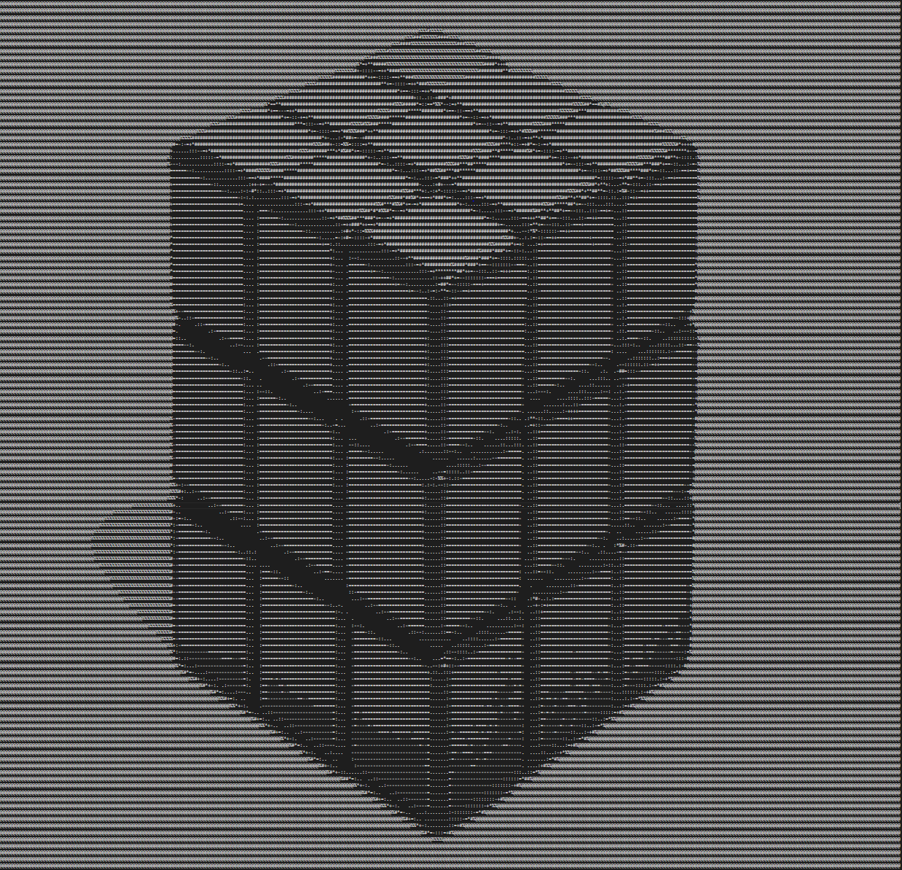

# Ascii Art Generator

## Usage:

    python main.py --url your_image_url 
    python main.py --local-url your_image_url

## Options
   
- url - the url of the image to convert
- local-url - the address of a local image to convert
- bw - the block width (higher values result in an image with less columns, though details may get distorted). Default value is 4
- bh - the block height (higher values result in an image with less rows, though details may get distorted). Default value is 5
- file - the filename for the output file. Default value is 'output.txt'

## Example

    

